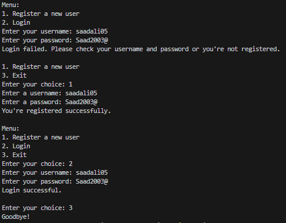
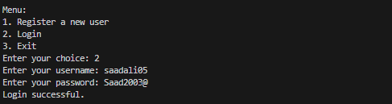

<html>

<body>
    <h1>Password Policy Enforcement</h1>
    
A Python script for enforcing strong password policies during user registration and login. This script uses SQLite for data storage and ensures that passwords meet specific criteria for strength.

  <h2>Features</h2>
    <ul>
        <li><strong>Database:</strong> Utilizes SQLite for storing user data.</li>
        <li><strong>Password Policy:</strong> Enforces a minimum password length and requires a mix of uppercase, lowercase, digits, and special characters.</li>
        <li><strong>User Registration:</strong> Allows users to register with a username and a strong password.</li>
        <li><strong>Login System:</strong> Permits secure user logins.</li>
        <li><strong>Menu Interface:</strong> Provides a simple command-line menu.</li>
        <li><strong>Error Handling:</strong> Manages duplicate usernames and errors.</li>
    </ul>

   <h2>Getting Started</h2>
    
Follow these steps to get started with this project:

    <ol>
        <li>Clone the repository: <code>git clone https://github.com/saadali05/Password_policy.git</code></li>
        <li>Navigate to the project directory: <code>cd password-policy-enforcement</code></li>
        <li>Run the script: <code>python password_policy_enforcement.py</code></li>
    </ol>

   <h2>Usage</h2>
    
Choose between user registration or login. During registration, strong passwords are required based on the defined password policy. User information is stored in an SQLite database.

   <h2>Screenshots</h2>
    
Here are some screenshots showcasing the script in action:

    
    
<em>Complete Working</em>

    
    
<em>Registration Example</em>

    
    
<em>Login Example</em>

  <h2>Contributing</h2>
    
Contributions are welcome! If you'd like to contribute to this project, please follow these steps:

    <ol>
        <li>Fork the project.</li>
        <li>Create a new branch for your feature: <code>git checkout -b feature-name</code></li>
        <li>Make your changes and commit them: <code>git commit -m "Add feature"</code></li>
        <li>Push your changes to your fork: <code>git push origin feature-name</code></li>
        <li>Create a pull request on the original repository.</li>
    </ol>
</html>
